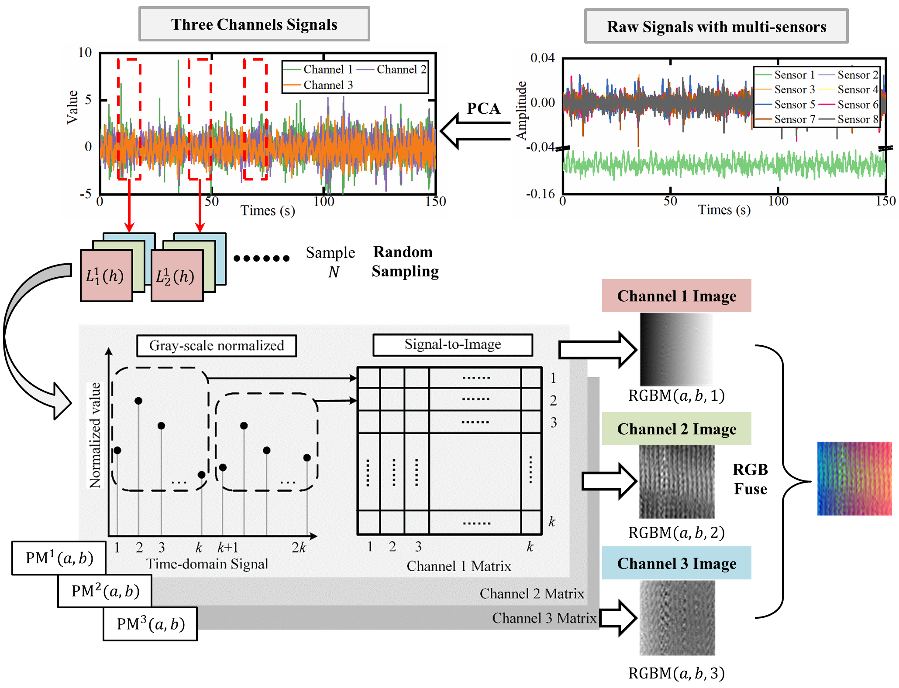

# MSF-CNN for Intelligent Mechanical Fault Diagnosis



<p align="left"> 
    <a href="https://www.python.org/">
        </a> 
        </a>
    <a href="https://doi.org/10.1109/TII.2021.3102017">
        </a>
</p>
This repository contains source code for TII paper "Intelligent Mechanical Fault Diagnosis Using Multisensor Fusion and Convolution Neural Network". 


## Citation

If this project useful for your research, please cite the original journal paper with the following BibTex entry.

```
@article{xie2021intelligent,
  title={Intelligent Mechanical Fault Diagnosis Using Multisensor Fusion and Convolution Neural Network},
  author={Xie, Tingli and Huang, Xufeng and Choi, Seung-Kyum},
  journal={IEEE Transactions on Industrial Informatics},
  volume={18},
  number={5},
  pages={3213--3223},
  year={2021},
  publisher={IEEE}
}
```

